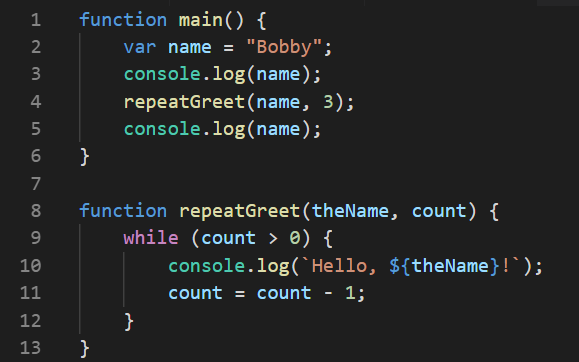

# Chapter 7: High-Quality Routines

Read Chapter 7 in *Code Complete*.

## 7.1 Reasons to Create a Routine

As I mentioned earlier, many students reach a stage where they try to write one long routine to solve programming problems that are too big for that approach.

I get the feeling that sometimes students think a program is more complicated when broken into pieces through routines. Perhaps there is some truth to that when you are first learning. After some practice, however, it makes things easier. If you want to be a great (or even good) programmer, you have to overcome the tight limits on human short term memory and attention span. Routines are one of the most powerful tools for doing this.

Hopefully McConnell has convinced you with his list of *why* routines are a good idea. Just to be sure that you really understand *how* a routine call works, let's look at an example. Here are two routines (JavaScript functions).




Assume that `main` begins executing (it was called from somewhere, but it doesn't matter where). Here is a trace of the execution. The first column tells you which routine you are in, and the second column shows you the current line number. As you move down each row, you are moving to the next statement to be executed (leaving out the loop tests). The next three columns show you the value (if any) of the three variables *after* the indicated statement completes. The final column describes what happens.

| Routine       | Line | `name`         | `theName`      | `count`        | What happens                                                 |
| ------------- | ---- | -------------- | -------------- | -------------- | ------------------------------------------------------------ |
| `main`        | 2    | `"Bobby"`      | (out of scope) | (out of scope) | literal value is assigned to local variable                  |
| `main`        | 3    | `"Bobby"`      | (out of scope) | (out of scope) | displays `"Bobby"`                                           |
| `main`        | 4    | `"Bobby"`      | (out of scope) | (out of scope) | pushes local variables and current line number onto call stack, jumps to beginning of `repeatGreet`, binds actual parameters to formal parameters |
| `repeatGreet` | 10   | (out of scope) | `"Bobby"`      | 3              | displays `Hello, Bobby!`                                     |
| `repeatGreet` | 11   | (out of scope) | `"Bobby"`      | 2              | formal parameter is decremented                              |
| `repeatGreet` | 10   | (out of scope) | `"Bobby"`      | 2              | displays `"Hello Bobby"`                                     |
| `repeatGreet` | 11   | (out of scope) | `"Bobby"`      | 1              | formal parameter is decremented                              |
| `repeatGreet` | 10   | (out of scope) | `"Bobby"`      | 1              | displays `"Hello Bobby"`                                     |
| `repeatGreet` | 11   | (out of scope) | `"Bobby"`      | 0              | formal parameter is decremented                              |
| `repeatGreet` | 13   | (out of scope) | `"Bobby"`      | 0              | pops call stack to get line number that called it, then jumps there |
| `main`        | 4    | `"Bobby"`      | (out of scope) | (out of scope) | pops call stack to restore values of local variables         |
| `main`        | 5    | `"Bobby"`      | (out of scope) | (out of scope) | displays `"Bobby"`                                           |
| `main`        | 6    | `"Bobby"`      | (out of scope) | (out of scope) | pops call stack to get line number that called it, then jumps there |


To summarize, a statement that calls a routine causes execution to jump to the beginning of that routine. There may be some arguments passed. After the called routine completes, execution jumps back to the instruction that called it. Study the trace to make sure that you follow the details about how the call stack is used, and how local variables go in and out of scope.

The trace table contains some terminology that need explaining. Unfortunately, different authors use these somewhat differently.

For this class, the words **argument** and **parameter**, when used alone, mean the same thing: a loose term for the data passed when a routine is called. However, sometimes there is a need to make a distinction that shows up in the trace: in the routine call, the local variable's *value* "Bobby" and the literal *value* 3 are the ***actual* parameters**: the data values that are actually passed in that particular call. In the called routine, the names `theName` and `count` are the ***formal* parameters**: the symbolic identifiers used to refer to whatever values were passed into a call. We say that the actual parameters are bound to the formal parameters. The term **binding** refers to connecting an identifier (name) with the data that it names; this can be done by assignment, parameter passing, and in other ways.

FYI, some authors use "argument" to mean "actual parameter" as defined above, and "parameter" to mean "formal parameter" as defined above.

## 7.2-7.4 Cohesion, Routine Names, Routine Length

These sections are full of good guidance that you should practice as far as prudent.

You should definitely understand the idea behind good and bad forms of **cohesion**.

## 7.5 Parameters

Now it's time to look more deeply into the details of parameter passing. This information is needed as background for some of McConnell's guidance in this section.

Different PLs implement parameter passing differently. This can lead to different behavior, so it is very important to know what parameter passing mode(s) your PL uses.

Since the Pascal language implements two important parameter passing modes, we will use it for illustration. (The code discussed below is available [here](https://ideone.com/XPD3OI)).

When a call to a routine is made, the actual parameters listed in the calling statement are *bound* to the formal parameter names listed in the routine's definition. Most PLs do this by position: the first actual parameter is bound to the first formal parameter, second actual bound to second formal, and so on.

The other details of the binding vary with different parameter passing modes.

### Pass By Value

When parameters are **passed by value**, a copy of the actual parameter's value is made, and this copied value is bound to the formal parameter name. Consider the following Pascal program with a routine named `pass_by_value`. 

```pascal
program parameter_passing_modes;
var actual: integer;

procedure pass_by_value(formal: integer);
begin
   formal := formal + 1;
end;

begin
  actual := 1;
  writeln(actual);
  pass_by_value(actual);
  writeln(actual);
end.
```

The main routine creates some variables with values, calls the `pass_by_value` routine, and finally prints the values of its variables.

The output from this code is:

```
1
1
```

In the `pass_by_value` routine, the copied value is modified. The modified copy is destroyed when the routine returns, leaving the original value unchanged in `actual`.

Pass by value provides a sort of security, if it matches the desired behavior. However, it can be expensive (in terms of memory) to make copies of large amounts of data, as when passing an array.

Many PLs use pass by value as their only parameter passing mode.

### Pass by Reference

Suppose we changed the Pascal program above so that the main routine calls a procedure named `pass_by_reference`, which is defined as follows.

```pascal
procedure pass_by_reference(var formal: integer);
begin
   formal := formal + 1;
end;
```

This might look identical to the `pass_by_value` routine above, but it's not. The keyword `var` appears just before the name of the formal parameter, and that makes all the difference.

The output from our modified program is different:

```
1
2
```

When we use **pass by reference**, a reference to the actual parameter is bound to the formal parameter name. The formal parameter is not a copy of the original; it is an alias for the actual parameter. When the routine changes the value, that change survives the return to the calling code.

Pass by reference provides power and flexibility, if that is the desired behavior. It is also sometimes used for reasons of efficiency, in order to avoid creating copies of data.

### Passing a reference by value

In PLs that have reference types, it may be possible to produce side effects similar to pass-by-reference's results, even though parameter passing is *implemented* only as pass-by-value.

Imagine a JavaScript function that receives an object as one of its arguments. The variables that "hold" objects in JavaScript (and many other OO PLs) are reference variables. JavaScript is pass-by-value only, which means formal parameters are bound to copies of actual parameters. But, a copy of a reference is ... another reference to the same underlying object. You cannot change the formal parameter in a way that survives the return-- that is, you cannot change which object is referred to. But you can change the internal properties of the object and have those changes survive the return. This is because you are not working with a copy of the object. You are working with a copy of a reference to that object, but a reference and its copy both lead to the same object.

Many programmers believe that, if side effects are somehow possible, it must by pass-by-value. But it's not the resulting behavior that counts; strictly speaking all these modes refer to how the PL is implemented-- how it binds actual parameters to formal parameters. This has launched a thousand arguments at stackoverflow.com. 

### Other Parameter Passing Modes

Pass by value and pass by reference are not the only parameter passing modes. 

A few modes are historical relics, largely abandoned in the evolution of PLs.

Python uses the term "pass by assignment". In Python, variables are not aliases for memory addresses or for values stored at a particular address. Instead, a variable is an alias for the value itself (for an object, Pythonists would say). So, binding associates a variable with an object, within a certain scope. Although this is an entirely different way of thinking about variables and implementing parameter passing, the resulting behavior is relatively familiar.

If the parameter passed to a Python routine names a non-constant ("mutable") object, the result will match the pass by reference example above. The name is bound to the same object in both scopes: the calling code and the routine. So, changes made to the parameter within the routine will be seen after the call completes.

However, if the parameter passed to a Python routine names a constant ("immutable") value, the result will match the pass by value example above. This is because the assignment in the Python routine creates a different binding for the name, with the scope limited to the routine itself. This is not making a copy of the data as in pass by value, but the result is much the same: changes made using the separate binding inside the routine will not affect the binding in the calling scope.

### Getting back to McConnell (finally!)

McConnell categorizes parameters as input-only, input-and-output, and output-only. Input-only parameters are values passed to a routine for it to "read only"; the routine is not expected to make changes that will persist after the call completes. Input-and-output parameters are for the routine to read and write to, making changes that will persist after the call completes. The final category is "write only": the parameter is passed solely for the purpose of the routine making changes that will persist after the call.

This entire discussion is only applicable if your PL provides some way to modify formal parameters that affects the actual parameters. It is also a bit less relevant because parameter lists tend to be shorter than in the past. They are often shorter because we can pass a single object, with many internal properties, instead of passing all those values as individual parameters. However, McConnell's suggestions here are sound, if they apply to your situation.

All the other parameter guidance is good. Use it in your programming as far as is prudent.

## 7.7 Macro and Inline Routines

The topics are most relevant to C and C++. Tool sets for these languages include a preliminary step before compilation, performed by a tool called the "preprocessor". The preprocessor handles "directives" that start with `#`. See [preproc.c](https://github.com/dewv/csci-201/blob/master/homework/chapter7HighQualityRoutines/preproc.c) for some examples. The `MAX` macro is a dangerous use of the preprocessor. The simplest, safest rule is simply this: macros are fine for constant values, but for expressions involving variables or operations, beware. Avoid such macros if possible. If you must use them, do your homework to be sure that you understand the risks and that your code is safe.