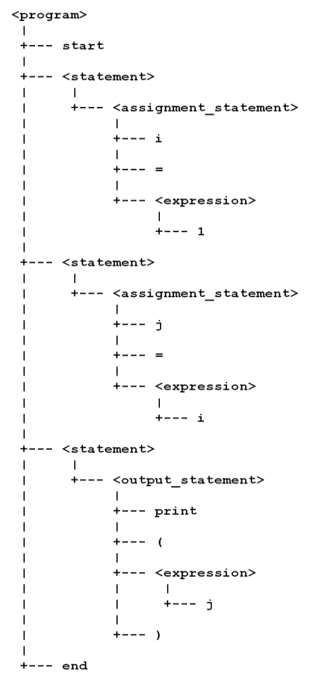

# Finishing the Parser

The next step in parsing is to take the sequence of lexemes identified by the lexer, and build a tree that represents the structure of the input program.

## A BNF Grammar

Here is the BNF grammar for our source language. (Recall that "source language" refers to the language being implemented.)

```
<program> ::= start <statement>* end
<statement> ::= <assignment_statement> | <output_statement>
<assignment_statement> ::= IDENTIFIER = <expression>
<output_statement> ::= print ( <expression> )
<expression> ::= IDENTIFIER | NUMERIC

```

To summarize, a program consists of the reserved word `start`, followed by a set of zero or more statements, followed by the reserved word `end`. Each statement is either an assignment statement or an output statement. There are grammar rules for both types of statement; the rules refer to terminal symbols (such as `print`), a nonterminal symbol (`<expression>`) and two specific tokens (`IDENTIFIER`, `NUMERIC`) that were defined in lexical analysis.

## Parsing the Grammar

The general approach is to use your implementation language to define an abstract data type (ADT) for each of the nonterminal symbols in the grammar of the source language.

For example, the GML implementation of this grammar defines the objects `obj_program`, `obj_assignment_statement`, and `obj_output_statement`; each corresponds to one of the grammar's nonterminal symbols.

There is also a parse routine for each nonterminal-- scripts named `parse_program`, `parse_assignment_statement`, etc. Each of these compares the sequence of lexemes (built earlier) with the expectations of the grammar rule. For example, the `parse_program` script verifies that the first lexeme has the token `START`. It then uses a loop to repeatedly call the `parse_statement` routine. When all these have completed, `parse_program` finishes by verifying that the last lexeme has the token `END`.

Each parse routine follows this general pattern for verifying its grammar rule: directly check tokens for the terminal symbols in the rule, and call other parse routines to delegate the verification of nonterminal symbols in the rule. As this parsing is carried out, a tree is built to represent the structure of the input program. For example, the single instance of `obj_program` is the root of the tree; it contains an array of statement instances (`obj_assignment_statement` or `obj_output_statement`). Each statement instance stores information about its grammatical components. For example, each instance of `obj_assignment_statement` will store the identifier that appears on the left hand side of the statement, and the expression that appears on the right hand side.

When the process completes without error, the parser will display a textual representation of the parse tree. Here, for example, is the parse tree that represents a familiar program with three statements (between `begin` and `end`).



If the parsing routines encounter a lexeme that does not fit the grammar rules, then the parsing process will terminate with an error. Generally, it is possible to display a message indicating what was expected (according to the grammar rule) and what was actually found (in the lexemes of the source input). In the simplest possible example, the parser will complain that `start` was expected if the first lexeme is anything other than that reserved word.

------

Note. Textbook presentations of tree data structures are usually very abstract, modelling general trees as nodes (vertices) and edges (links or connections). In specific scenarios like parsing, it is often useful to model tree-like relationships in a different, less abstract way. For example, the GML parsing code does not explicitly deal with nodes or edges. Instead, the program object (the tree root) contains an array of statement objects (its children). An assignment statement always has three children: a left-hand-side (`lhs`), an assignment operator, and a right-hand-side (`rhs`). The GML object stores the `lhs` identifier and the `rhs` expression in normal instance variables. There is no need to store the assignment operator, because the object "knows" that it is an assignment.