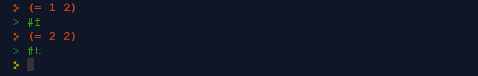

# Functional Programming

So far, we have discussed two programming paradigms.

The procedural paradigm flows directly from the traditional von Neumann architecture for hardware; procedural PLs can be seen as the machine language of virtual machines that build on the underlying hardware. The variables of procedural PLs are an expanded version of the hardware registers; taken together, the values they store define the current state of the machine.

The control structures of procedural PLs are based on the familiar idea of sequential instructions, with conditional jumps that are used for branching and iteration.

Procedures allow you to modularize larger programs by creating named routines that are, in effect, new instructions in the language. Some procedures, like mathematical functions, take arguments and return values. Other procedures return no value, but are called for their **side effects**: the changes that they make to the current state of the program/machine. Smart, disciplined programmers organize their procedural programs around the concept of abstract data types.

The object-oriented paradigm expands the procedural paradigm by adding features that support a particular approach to implementing ADTs. An instance (or object) is a container for both the data and the procedures (or methods) that make up an ADT.

It's now time to look at a third paradigm. Functional programming ignores or even eliminates the machine-oriented concepts of sequential instructions, current state, and side effects. In its purest form, functional programming consists only of applying functions in the mathematical sense: given certain arguments, a function will always compute the same result. The inputs alone determine that result; there is no influence from any outside information or program state.

This is a much higher level of abstraction than traditional procedural programming. As a result, it is simpler in concept, which makes it easier to prove formal theorems about the nature of functional programs and computations. On the other hand, you might wonder how function application alone can match the power of procedural programming's conditional and loop instructions.

The short answer is that conditional instructions are typically replaced with conditional expressions, and loops are typically replaced with recursion. But to grasp this, you need examples.

## Running Lisp

The Lisp programming language and its many dialects and variants are important examples of the functional paradigm.

Lisp was created around 1958, making it the second oldest PL in wide use (after Fortran). Its strength is LISt Processing, making it great for symbolic and linguistic computation. This complements Fortran's strength at math (FORmula TRANslation). Lisp has been widely used in artificial intelligence research.

Lisp syntax takes some adjustment. It uses prefix notation (also called Cambridge or Polish notation). The syntax is fully parenthesized, which means that no precedence rules are needed. Both data and code in Lisp are represented as lists; this makes it easy for Lisp programs to operate on other Lisp programs.

You will use the web-based environment at [https://repl.it/languages/scheme](https://repl.it/languages/scheme). REPL (Read-Evaluate-Print Loop) is a common term for language implementations that are more formally known as **interactive interpreters**. This refers to language interpretation in the familiar sense, where the main user action is to interactively type code that is immediately evaluated for display. This REPL web tool implements a number of different PLs, functional and otherwise. Here we're using Scheme[*](#note), which is a popular dialect of Lisp.

At first, we will be ignoring the code editor on the left side of the screen, using only the interpreter prompt on the right side.

The "hello world" program in Lisp is trivial.

The image above shows that strings of text enclosed in quotes are treated as constants (or "atoms" in Lisp terminology). The interpreter evaluates the input (in red) and displays the resulting value (in green): the string itself.

Numbers are also atoms, so asking the interpreter to evaluate 5, for example, will produce similarly boring results.

Now for some prefix notation parenthesized Lisp:

The first input is a Boolean expression; in effect, it asks if 1 is equal to 2. The interpreter responds with a special atom value meaning "false". (The words `false` and `nil` may also be used in some settings.)

The second Boolean expression asks if 2 is equal to 2. The interpreter responds with a special atom meaning "true".

Now try this:

Since the symbol `x` has not been given a value ("bound"), the interpreter prints an error.

In the second input, the single quote means "do not evaluate the symbol that follows". This input is accepted without error, but really does nothing except echo back the name of the unevaluated symbol.

## Constructing Lists

Next, we will look at some LISt Processing. Lists are recursively defined: for the base case, a list may be empty, or `nil`. For the recursive cases, a list is an atom followed by a list, or a list followed by a list.

The `cons` function constructs a list from two arguments, as shown below.

In the first example, the single quotes prevent evaluation of the atom `a` and the list containing `b`. The result is a list containing the first argument, followed by all the elements from the second argument (which must be a list).

The second example shows that the first element does not have to be an atom; it could be a list. The result is a list containing three elements, the first of which is a list containing two elements.

## Deconstructing Lists

Working in the opposite direction, we can access the component parts of a list. The `car` function returns the first element from a list.

The `cdr` function returns everything after the first element of the list. Notice that the result is a list.

So how would you extract the second element from this list? Applying `cdr` eliminates the input's first element from the result; applying `car` to this result returns the second element from the original input.

Notice that sequences like `(car (cdr (...)))` can be abbreviated as `(cadr (...))`. 

How would you extract the last element?

The first example above returns the input's last element as a singleton list. The second example returns the input's last element as an atom.

## Conditional Expressions

Lisp has no conditional statements; only conditional expressions. This means that there is no way of conditionally choosing different paths through the instructions; there is only a way of conditionally selecting values.

The `if` function evaluates its first argument; if true, the overall expression returns the second argument; otherwise it returns the third argument.

Conditional expressions can be nested.

But it is easier to write expressions with multiple conditions using `cond`, as shown below.

These two examples are exactly the same. The second version shows how the interpreter will allow you to continue input on multiple lines until all parentheses are closed and you press Enter.

## Defining Functions

The first example above defines a function named `square`, which takes one argument labeled `x`. When evaluated, it returns the value of its argument times itself.

The second example illustrates applying the new function to a value of 4.

## Higher-order Functions

One important concept of functional programming is that functions can act on other functions. These are called **higher order functions** (also known as functionals or functors). A higher order function takes another function as one of its arguments and/or returns a function. For example, many functional languages include a `map` function, which takes two arguments: a function, and a list of values to be processed by that function. Here, `map` is used to apply our square function to a list of values.

## Property Lists

One common use of Lisp's lists is for property lists or **p-lists**. These are lists of name, value pairs.

Here, the symbol `DS` is defined to be a list of name, value pairs that represent an employee data record. Evaluating the symbol `DS` simply returns the list.

This p-list can be manipulated with the following function.

The `getprop` function takes two arguments: a property name, and a property list. It examines the list's first element to see if it matches the specified property name. If so, it returns the second item from the list. If not, it recursively searches for the same property name in the sublist that follows the first name, value pair. The effect is a lookup routine, like this:

------

[*](#ref) Be aware that different dialects of Lisp use different symbols, so some translation is necessary. Although we are technically working with a Lisp dialect named Scheme, I will use the name "Lisp" throughout. Scheme and "Common LISP" are probably the two most popular dialects. A descendant of Scheme called Racket provides some excellent educational resources.