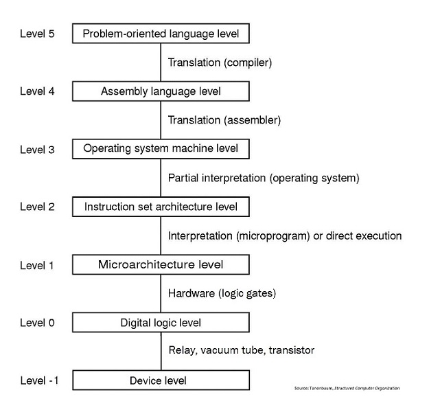

# Hello, world!

Traditionally, the first program that you learn to write in a new language is a program that displays the message "Hello, world!". 

For most languages, this is about the simplest complete program possible. When you successfully write it, you've learned to do two fundamental things with your language:
1. Get a program-- any program-- to run by doing whatever is necessary in terms of program structure, file setup, compilation, linking, execution, etc.
2. Produce output, which is probably the most fundamental (simple and important) thing to do.

Try to write and run the "Hello, world!" program in your language.

## Language Implementations

As you may recall from the "How Hardware Works" course, there are two fundamental approaches to implementing a programming language: translation and interpretation.

In our multi-level architecture scheme, we are primarily looking at Level 5, sometimes drilling down into Level 4, and occasionally looking further down.

### Translation

Source code in the PL is translated into a different language that the underlying machine can more easily handle. The most common translation program is a compiler, and I will often use "compilation" as a synonym for "translation". An assembler is another type of translation program that we discuss in other courses.

Translation produces a new program, in a different language, that is actually executed by an underlying machine (either physical or virtual). This means that the translation only needs to happen once (assuming that you are finished making changes to your program).

### Interpretation

A run-time environment simulates the effect of the program in your PL. At run time, a program called an interpreter reads your source code and executes machine instructions that have the same effect.
This means that the interpretation process happens every time you execute your program. This often means that:

- interpreted programs are slower than translated/compiled ones
- you must have the source code to run the program.

The points are gross generalizations, with many caveats and exceptions.

### Hybrid implementations

Some language implementations combine translation and interpretation. The most common example is the typical Java implementation. Usually, Java source code is compiled into a binary language called Java byte code. However, Java byte code is not the machine language that runs on PCs, Macs, or the like. Instead, it is the machine language for the Java Virtual Machine (JVM).

The JVM is usually a piece of software that interprets the Java byte code. This hybrid approach allows the same Java byte code to run, without changes, on different operating systems and different hardware. (The JVM software is specific to the OS and hardware, so the Java application programmer is insulated from these differences. It is also possible to find the JVM implemented directly in hardware.)

Microsoft's .NET platform takes a somewhat similar approach. In this case, the VM/interpretation is built into the OS, and there are multiple PLs (C++, VB, C#) that can be compiled to the same "Common Intermediate Language" bytecode.

### Implementation is independent of language

Any PL can be implemented through translation, or through interpretation, or through a hybrid approach.
While many languages are strongly associated with particular approaches (C is usually compiled, Java is usually hybrid), there is nothing required or necessary about this. There are C interpreters and there are non-hybrid Java compilers. These are alternative implementations of the same language.

## Programming toolsets

Again, there are two fundamental approaches, which can be blended to varying degrees.

### Integrated Development Environments (IDE)

IDEs are a "Swiss army knife" that combine many useful tools. Typically they include the ability to do many of the following within the same tool:

- edit source code
- execute programs
- click on an error message to jump to that line of code
- trace programs by executing them one step at a time
- view the contents of variables in memory
- measure the performance of different steps within the program
- file management
- team coordination features
- task tracking

Some IDEs target a particular programming language; others can handle multiple PLs. Popular IDEs include Eclipse, NetBeans, and Microsoft Visual Studio.

### Old School

Many excellent programmers avoid IDEs and primarily use a text editor program plus a compiler or interpreter for their PL. The other features listed above can be used through a set of independent tools.

Programmers can become very attached to their text editor of choice, leading to "editor wars".

**xkcd: Real Programmers**

## What about GameMaker?

Let's relate these concepts to the GameMaker programming that we covered in the first two courses.

While older versions of GameMaker used interpretation, GameMaker Studio apparently uses a virtual machine approach, similar to Java. Apparently, this is how GameMaker Studio targets multiple platforms: Windows, Mac, Linux, iOS, Android, XBox, etc. 

There is also an optional compiler, available for a fee, that claims a 100x speed improvement.

As for toolsets, GameMaker Studio is an integrated development environment. However, you can change its behavior to use any text editor you wish in place of the built-in text editor for GML code. 
