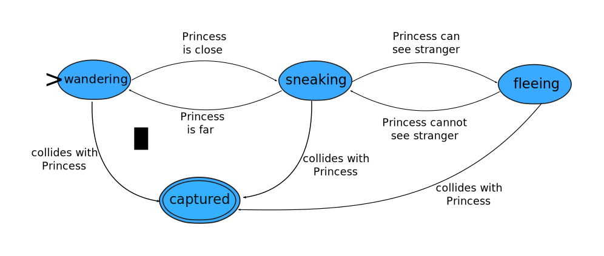
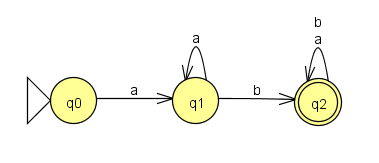
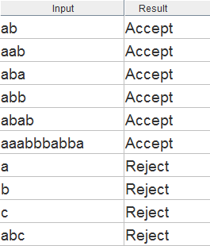

# Lexical Analysis and Regular Expressions

You may recall that one of the learning goals for this course is to understand how programming languages are implemented. We have already covered the differences between compiling, interpreting, and hybrid approaches to language implementation. This topic is the first of several that will drill down into the details of implementing programming languages.

The typical first step for compilers and interpreters is **lexical analysis**. The **lexics** of a programming language refers to the way that characters are combined to make words and other meaningful sequences. In lexical analysis the input source code is converted from a sequence of characters into a sequence of "lexemes". A **lexeme** is a word, symbol, etc.-- a meaningful chunk to pull from the input text. Lexemes are often the reserved words of the language (like `if` and `while`), operators (like `+ - * / =`), and identifiers (names of variables, functions, etc.) The software routine that performs lexical analysis is often called a **lexer** or **scanner**.

Any PL has a finite list of reserved words, operators, and similar symbols; these are easy to identify by direct string matching. On the other hand, there could be an infinite (or at least very large) number of valid identifiers for variables, functions, etc. It is not feasible to list these in advance. But, since most PLs require identifiers to conform to certain rules, potential identifiers in the source code could be tested for validity. In a similar way, it is not feasible to give a list of all valid integer values, all valid string values, and so on. What we need is a way of defining the *patterns* that describe valid values.

## A meta-machine perspective: finite automata

You are already familiar with one notation that will work here. The finite state machines that were used to model NPC behavior in GameMaker are one solution. To refresh your memory, have a look at this finite state machine.

This says, for example, that the mysterious stranger NPC enters a sneaking state when it is close to the Princess player character, and begins fleeing from the player when there is a direct line of sight.

We will need to expand these ideas using concepts from areas of computer science called computational theory and formal languages. In computational theory, a finite state machine is known as a **finite automaton**. ("Automaton" is just a fancy word for "machine"; the plural is "automata".) Theoretical computer scientists will usually refer to DFAs or NFAs, which stand for deterministic finite automata and non-deterministic automata, respectively. For our purposes here, we will stick with DFAs.
Deterministic finite automata (DFAs) are formal mathematical models. Here is a DFA diagram produced with the JFLAP software tool.

A DFA is a directed graph where the nodes represent states and the edges (arrows) represent state transitions. (**State transition diagram** refers to DFAs shown in this kind of notation.) State transitions are labeled with data values for matching portions of the input string to be tested. The DFA shown above has three states: `q0`, `q1`, and `q2`. The triangle marks `q0` as the **initial state**, meaning that is where things start. Every DFA must have exactly one initial state. The double circle marks `q2` as a **final state**. Every DFA has one or more final states. If we arrive in a final state with no more data to process, then we have processed the input successfully.  This means that the input was accepted as valid; it matches the pattern defined by the DFA.

The DFA above is a precise formal description of a text pattern that could be informally described in English like this: valid strings start with "a", followed by any number of "a", followed by "b", followed by any number of "a" or "b". Here are the results when the JFLAP software is used to test various input strings against this DFA.



To test each input, start at the DFA's initial state `q0`, then follow transitions that match the input's first remaining character (and cross off that character). The input is accepted as valid if you are in the final state `q2` with no input characters remaining. If you have remaining input characters with no matching transition, then the input is rejected.

Ok. We have shown that we can use DFAs to define the text patterns for valid identifiers in a PL, or for valid integer values in a program, etc. While this will work, DFAs are not the most convenient notation for use in actual programs. Let's explore an alternative.

One of the fundamental lessons of the "How Hardware Works" class was the close relationship between machines and languages. Every machine defines a language. In this context, **language** means a set of strings; the language defined by a DFA is the set of strings that are accepted by the machine.

A closely related point: machines can be replaced by languages, and vice-versa. We usually take this to mean that we can build an application-specific hardware device, or alternatively we can write software for a general-purpose programmable device. But we can make this move with respect to more abstract machines and languages, too.

## A meta-language perspective: regular expressions

We are now going to replace the DFA (machine) above with an equivalent language. This simply means that we will model the same text pattern described by the DFA in a different way: using text. This text is written as a regular expression.

A **regular expression** is a text string that uses a special syntax to define a pattern for text matching. If you have ever used "wildcards" like `*.*` or `*.docx` to match groups of filenames on your computer, then you have used something similar to regular expressions. The regular expression (also called a regexp or regex) can be used to test input strings: an input string either matches the regexp (by conforming to the pattern it describes), or does not match. A regular expression defines a *language*. The language is made up of the set of all strings that match the regexp.

Computational theorists have proven that every finite automaton can be converted to an equivalent regular expression, and vice-versa. There are algorithms for carrying out these conversions, and the JFLAP software implements some of them. For example, the JFLAP tool converts the DFA shown above to the following regular expression:

```
     aa*b(a+b)*
```

This is a textual representation of the same text pattern modeled by the DFA. In this regex, the characters "a" and "b" represent themselves. The asterisk is the **Kleene star**, which indicates zero or more of the item it follows. The parentheses are for grouping, and the plus symbol is the set union operator, which can be read as "OR". So the regex describes a pattern of "a", followed by zero or more "a", followed by "b", followed by zero or more of ("a" or "b"). Not the same English translation, but exactly the same text pattern as before.

Remember our goal here is to understand lexical analysis, the first step in implementing a PL. Lexers or scanners often make use of regular expressions to define lexical rules for a PL, but regular expressions also show up in other practical contexts. Many programmer's text editors allow sophisticated search and replace based on regular expressions. One of the classic Unix tools is `sed`, (stream editor), a programmable utility for transforming text using regular expressions. The programming language awk is frequently paired with `sed`. Many PLs allow the use of regular expressions for matching text patterns.

The regular expression syntax used in JFLAP is common in the area of formal languages and computational theory. However, most "practical" software such as lexers and text editors use a different regular expression syntax. Although the exact details can vary from one tool to another, most would write our earlier regex something like this:

```
     a+b[ab]*
```

In this syntax, the plus symbol has a different meaning. It is the **Kleene cross**, which means "one or more" of the preceding item. The asterisk is the same as before. The square brackets contain alternative choices. So the direct English translation is: one or more "a", followed by "b", followed by zero or more from ["a" or "b"]. Again, the same text pattern.

(By the way, the Kleene operators are named for [Stephen Kleene](https://en.wikipedia.org/wiki/Stephen_Cole_Kleene), a pioneer in mathematical logic and theoretical computer science.)

This practical syntax for regular expressions has other syntax features that allow a compact representation of complex patterns. Let's take an example from GML. According to the documentation, GML identifiers "must start with a letter and can contain only letters, numbers, and the underscore symbol". Here is a regular expression that defines the language of valid GML identifiers.

```
[a-zA-Z][a-zA-Z0-9_]*
```

The expression is using the dash to define ranges of characters. The first bracketed expression says that matching strings must start with a lowercase letter a-z or an uppercase letter A-Z. Then come zero or more repetitions of lowercase letters or uppercase letters or digits 0-9 or the underscore. You should be able to see that this regular expression defines exactly the pattern described in English by the GML documentation.

Computational theorists call the set of languages that can be defined by DFAs (or equivalently, by regular expressions) **regular languages**. Not all languages are regular; we will see later that our notations are not powerful enough to define all languages.

Did you notice that I referred to regular expressions as a language? But aren't they used to define languages? Yes, regular expressions are a formal language used to describe formal languages. Such languages are called **meta-languages**, and we're not done with them. (This is the language analog of the concept of virtual machines. Maybe they should be called meta-machines.)

Compilers and interpreters are meta-software: software that operates on other software.

Computer scientists just love to "go meta".


**xkcd: Regular Expressions**

