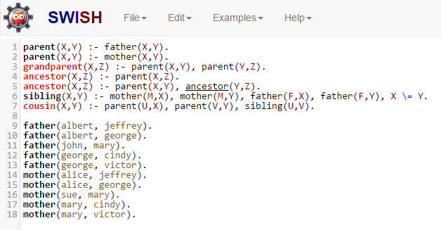
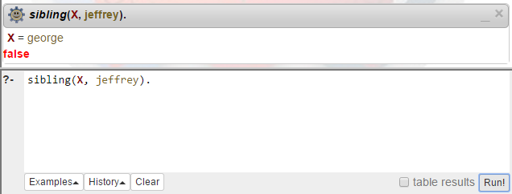

# Logic Programming

All of the programming paradigms discussed so far share one characteristic: all of them involve defining an algorithm that tells *how* certain results should be computed.

Instead, the last paradigm we will cover involves defining *what* needs to be computed, instead of how. This is possible because the paradigm is based on formal symbolic logic and proof. A logic program asserts the existence of the desired result. The language implementation attempts to find an existence proof through depth-first search. Anything that the system cannot prove is assumed to be false (this is called the **closed world assumption**).

## Prolog

The most popular PL in this category is Prolog (PROgramming with LOGic). Prolog has long been used in certain types of AI and diagnostics systems, as well as firewalls and other systems that are highly rule- or knowledge-based.

A Prolog program is made up of clauses (corresponding to statements in most PLs). Prolog clauses have three forms:

1. hypotheses (or facts): `mother(mary, cindy).`
2. conditions (or rules): `parent(X, Y):- mother(X, Y).`
3. goals: `parent(mary, Y).`

The fact above says that `mary` is the `mother` of `cindy`. Identifiers that begin with lowercase letters (like `mary` and `cindy`) are automatically defined symbols. The symbols, however, have no interpretation or value within the program.

The rule uses two variables, `X` and `Y`. Identifiers that begin with capital letters are variables. In Prolog, a variable's role is somewhat more similar to the role of a variable in algebra: it represents an unknown value. The rule says that some person `X` is the parent of another person `Y` if `X` is the mother of `Y`.

The goal states that `mary` is the mother of some person `Y`. This clause is not a fact, because there are variables (unknowns). It is not a rule, because it does not have the proper left/right form. So Prolog attempts to find a value for the unknown that follows logically from the known facts and rules. It responds:
​     `Y = cindy`

This means that `cindy` is an acceptable value for `Y`, the person whose `mother` is `mary`.

With  the same fact and rule above, the goal
​    `parent(Z, mary)`

asks the system to identify some person `Z` who is a parent of `mary`. The system responds
​    `no`

based on the closed world assumption.

## Running Prolog

GNU Prolog and SWI Prolog are two popular and free Prolog interpreters that you can install locally. However, we will use [SWISH](http://swish.swi-prolog.org/) for a few quick Prolog samples. This eliminates the need to install any software.

The SWISH Prolog screen has an input area on the left and query and output areas on the right. 

Enter the 7 rules and 10 facts shown. The facts represent a family tree, and the rules define certain familial relationships.

The rule on line 6 has some syntax that needs explaining. The commas that separate clauses mean "and". The last clause on line 6 means "X is not equal to Y". So the entire rule means "Some person X is the sibling of a person Y if some person M is the mother of X and M is the mother of Y and some person F is the father of X and F is the father of Y and X is not the same person as Y". The last clause prevents the system from saying that a person is their own sibling.

Notice that more than one rule can be used in defining the same concept, as in lines 1 and 2. This amounts to "or": two ways of satisfying the definition of parent.

Notice the recursive definition for `ancestor`. The base case is: a `parent` is an `ancestor`. The recursive case: the `ancestor` of your `parent` is your `ancestor`.

With this knowledge base in place, we can set goals. Suppose we want to know the names of jeffrey's siblings. Type the goal

​     `sibling(X, jeffrey).`

into the query area as shown (don't forget the period).

Click the `Run` button near the screen's lower right, and the system will respond that `george` is one solution for the unknown `X`.

Click the `Next` button under the output to see the next solution, and the system responds `false` to tell us that `jeffrey` has no other siblings.