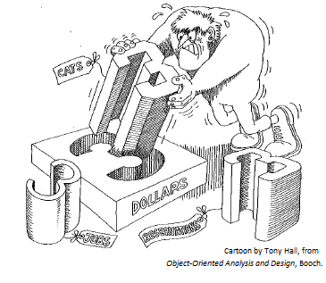

# Weak vs. Strong Typing

In its simplest form, the concept of a "data type" describes a particular way of encoding information in binary. Remember that it is not enough to see a bunch of bits without any context. You need to know what encoding has been used. The data type describes this encoding: it might be a two's-complement signed integer, a Unicode character, an IEEE 754 floating point format, a memory address, or something else.

You have seen some hints that the concept of "data type" might be extended to be more sophisticated. It's time to look at these ideas in detail.

## Weak Typing

Some PLs allow situations where the binary encoding format is all there is to a data type. These situations illustrate **weak typing**. Consider the following variable declarations in the C programming language.

```
unsigned int cats;         /* the number of cats in the animal shelter */
unsigned int dollars;      /* the balance in the animal shelter's bank account */
unsigned int jobs;         /* the number of open employee positions at the shelter */
unsigned int reservations; /* the number of people scheduled for pre-adoption meetings at the shelter */
```

An unsigned integer (always >= 0) is a reasonable data type to use for all of these variables. With these declarations, however, we could write the following statements and get no complaints from the compiler.

```
dollars = cats * jobs;
if (reservations == dollars) jobs = cats / 5;
```

Since these variables store numbers, and their binary encoding is all the same, the compiler is satisfied. However, those statements should seem like nonsense to you as a human reader, because the descriptive variable names (and documentation comments) convey meaning to you. Unfortunately, that meaning (or semantics) is not in a form that is available to a compiler.

You could summarize this perspective by saying: "3 is equal to 3, end of story. Doesn't matter if it's cats, jobs, or whatever. 3 equals 3." As you will see, some PLs allow you to take a different perspective by conveying semantics to the compiler.

By the way, the comments above tell the human reader that these four variables belong together in the sense that they are all about an animal shelter. It would be a good idea to show this relationship in code by grouping the variables using a structure or record (refer back to Chapter 13) or object-oriented techniques (which we will explore in a later chapter).

Here is a second example of weak typing in C code.

```
int ch = 'A';
```

This statement declares a variable named `ch` with an integer data type (C's `int` type), and then stores a character literal (of C's `char` type) in the variable. In C, this mixing of types is not considered a problem because, after all, a character is really just some numeric value from a character code like ASCII. The C perspective says that they are both ultimately numbers, so there's no problem with this statement.

Third, you could take this perspective to extremes by pointing out that everything-- all data-- is just bits. And C provides a way of working with this perspective: the `void` data type. The `void` type is a kind of "wild card", or a filter that allows anything through. It essentially says "just treat it as a bunch of bits". You can declare variables of type `void`, and you can also convert data of any type to type `void`. If a C function or procedure declares its parameters to be type `void`, then you can get away with passing any type of data for those arguments.

```
char message[6] = "hello";      /* C strings are implemented as char arrays */
void *buffer = (void *)message; /* buffer is now an alias for message, but without any data type "filter" */ 
buffer = (void *)malloc(1024);  /* a dynamically allocated buffer of 1024 raw bytes */
```

## Strong Typing

Now let's look at three examples of **strong typing**, with each in direct contrast to one of the three examples of weak typing.

First, some PLs allow you to create custom data types as abstractions with semantics. The perspective here is that the entire reason for defining a data type is to say that this type of thing is different from other types of thing. So 3 might or might not equal 3; the question is, 3 of *what*?



As the cartoon indicates, this perspective says 3 cats is different from 3 dollars, 3 jobs, and 3 reservations. PL features that exhibit this kind of behavior are examples of strong typing. Strong typing enforces higher level abstractions, allowing the programmer to define new, highly specific data types so that the PL enforces the kind of restrictions shown in the cartoon.  Consider the following Pascal definitions.

```
type 
   cat_type = 0..MAXINT;
   dollar_type = 0..MAXINT;
   job_type = 0..MAXINT;
   reservation_type = 0..MAXINT;
 
var
   cats : cat_type;
   dollars : dollar_type;
   jobs : job_type;
   reservations : reservation_type;
```

The `type` section defines four custom data types. All of them have the same definition, permitting integer values from zero through the maximum integer that the machine can represent. The `var` section declares a variable of each type. With Pascal's strong typing, statements like the "nonsense" shown above in C will produce compiler errors. The compilation fails even though the type definitions are identical and the binary representations are identical. The purpose of the different types is to convey the semantics that these different kinds of things should not be mixed.

Second, some PLs exhibit strong typing by preventing assignments that mix built-in data types in inappropriate ways. For example, some PLs would produce an error message for an attempt to assign a character literal to an integer type variable.

Third, most PLs do not provide any way of dropping type information from data as with C's cast to a `void` pointer.

## Terminology

You should know that different authors and experts define the terms used here in different ways.

I think that much of the variation comes from difficulties that arise when you try to put a PL into one of two distinct categories. In reality, a PL can have some features that exhibit weak typing and other features that exhibit strong typing. So we can't really describe a PL absolutely as strongly or weakly typed. Instead, it is a relative characteristic: considering all of their features, some PLs are more strongly typed than other PLs.